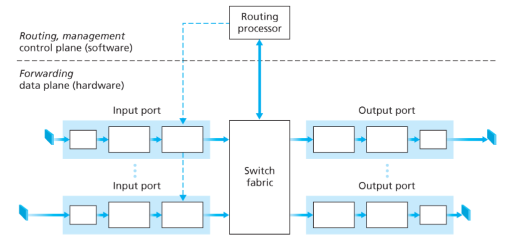
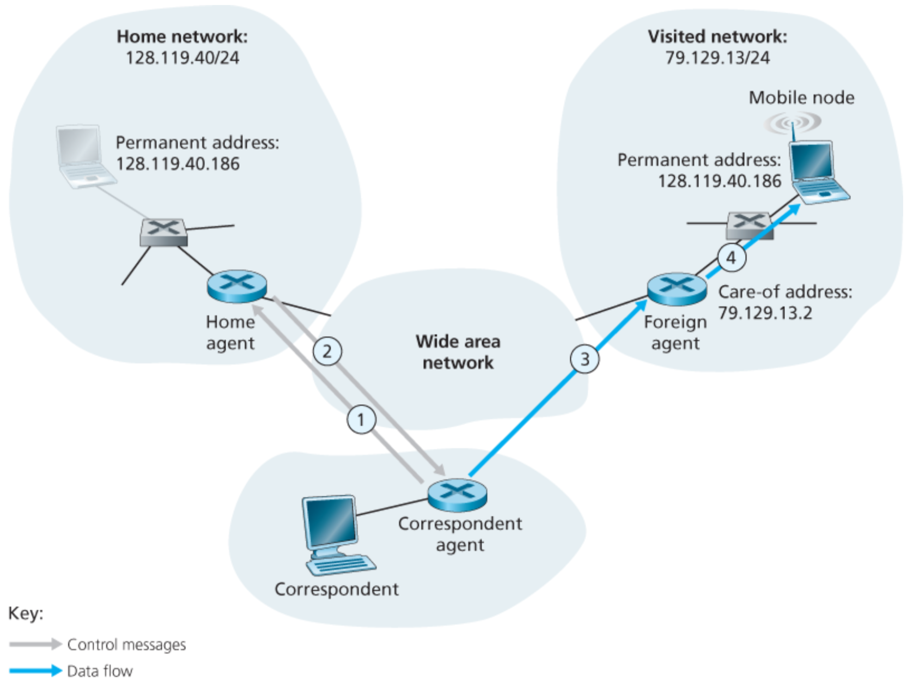
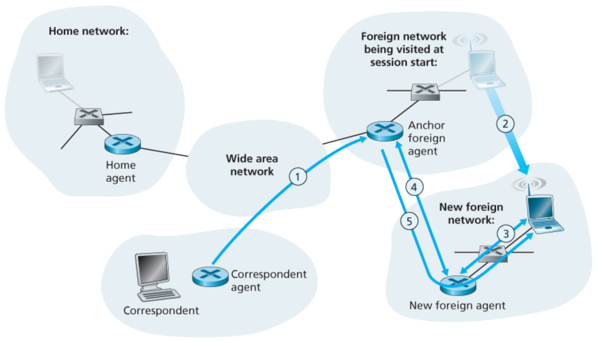
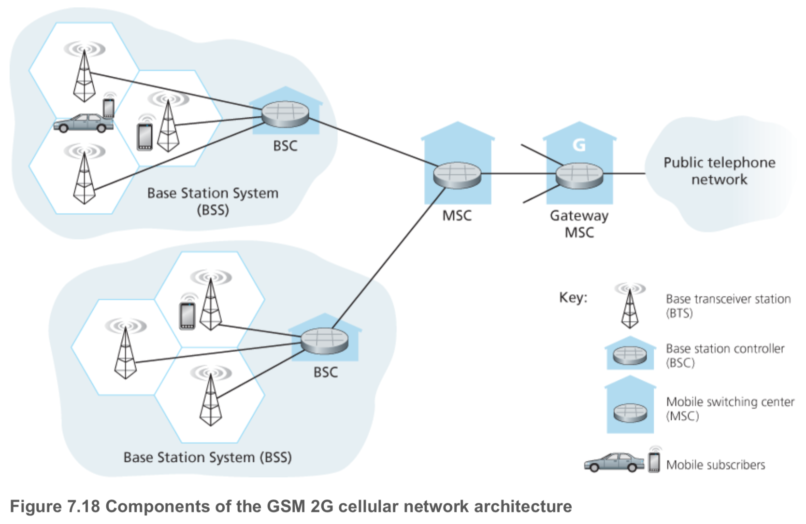
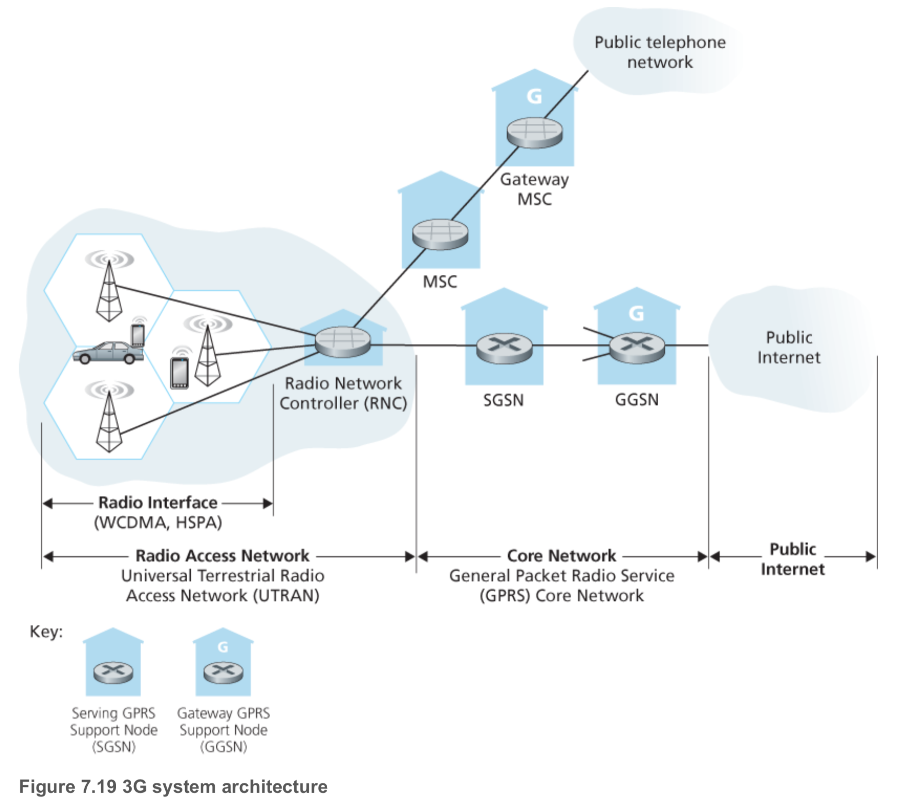
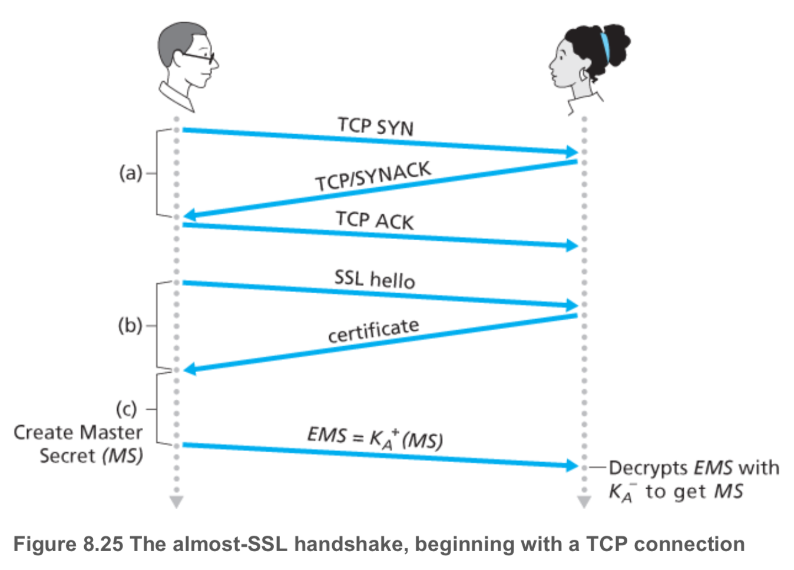

<style>
img {
    max-width: 600px!important;
    text-align: center;
}

img + img {
  padding-left: calc(50% + -300px);
}
</style>

# Computer Networking

- [Computer Networking](#computer-networking)
  - [1. Networks](#1-networks)
    - [The Internet](#the-internet)
    - [Performance Measurements](#performance-measurements)
    - [Protocols](#protocols)
  - [2. Application Layer](#2-application-layer)
    - [Applications](#applications)
    - [Process communication](#process-communication)
    - [Protocols / Applications](#protocols--applications)
  - [3. Transport Layer](#3-transport-layer)
    - [Services](#services)
    - [Flows](#flows)
    - [Protocols](#protocols-1)
  - [4. Network Layer - Data Plane](#4-network-layer---data-plane)
    - [Internet Protocol](#internet-protocol)
    - [Forwarding](#forwarding)
    - [Middle-Boxes](#middle-boxes)
  - [5. Network Layer - Control Plane](#5-network-layer---control-plane)
    - [Routing](#routing)
    - [SDN](#sdn)
    - [Other Protocols](#other-protocols)
  - [6. Link Layer](#6-link-layer)
    - [Services](#services-1)
    - [Multiple Access](#multiple-access)
      - [Channel Partitioning](#channel-partitioning)
      - [Random Access](#random-access)
      - [Taking-Turns](#taking-turns)
    - [Definitions & Protocols](#definitions--protocols)
  - [7. Wireless](#7-wireless)
    - [Wireless Networks](#wireless-networks)
    - [Mobile Networks](#mobile-networks)
    - [Cell Networks Internet Access](#cell-networks-internet-access)
  - [8. Security](#8-security)
    - [Network Security](#network-security)
    - [Cryptography](#cryptography)
    - [Protocols](#protocols-2)
  - [Web Request](#web-request)

<!-- pagebreak -->

## 1. Networks

### The Internet

The **Internet** is a Network of Networkss  

<!--
  Tier 1 / Content Providers -> IXP / Regional ISP -> Access ISP
  > There is a general hierarchy, but it is not a strict one.
  > It is all interconnected
-->

It uses **Packet Switching**, rather than Circuit Switching

An **Access Network** is the network that physically connects an end system to the first router

A **Host** / end system is a device on the edge of the network

An **Autonomous System** (AS) is a group of networks that are connected to each other under a centralized administration.

- Models
  - 5 Layer Model
  - OSI Model : Expands app layer into 3 layers

### Performance Measurements

**Latency** (time between action and reaction) is estimated through **RTT** (Round Trip Time)

Packets may face **Delay** (Processing, Queuing, Transmission, Propagation ) or even **Loss** ( mostly from full queues )

**Throughput** is the rate at which packets are transmitted over a link

### Protocols

A protocol defines:

- Request and Response messages
- Message structure (syntaxis)
- Message fields (size, function, delimiters)
- Procedure (sending and receiving)

<!-- pagebreak -->

## 2. Application Layer

> Network applications are the raisons d’être of a computer network

### Applications

A **network application** consists of pairs of processes that send messages to each other over a network,
it may have a **Client-Server** Architecture or a **P2P** Architecture.

> the process that initiates the communication is labeled as the **client**

### Process communication

The **socket** api is used to communicate.

a process is identified by:

- the address of the host (ip address)
- process identifier in the destination host (port)

> The lower layers could provide various guarantees, such as: reliable delivery, throughput, timing and security .

### Protocols / Applications

- HTTP
- Electronic Mail
- **DNS** (Domain Name System)
- P2P FTP
- Video Streaming w/ CDN

<!-- pagebreak -->

## 3. Transport Layer

> Communication between processes

### Services

- Must provide
  - **Muxing / Demuxing** (of processes)
  - Error Verification (minimal, checksum)
- Could provide
  - **Reliability** ( arrives . unchanged . in order )
  - Flow control ( throttle , with an eye on the data flow )
  - Congestion control ( throttle , with an eye on the network, share the channel equitably )
  - Security / Safety (Privacy / Authentication / Data Integrity / etc)
- Could provide, depending on lower layers
  - Time guarantees
  - Throughput guarantees

### Flows

A **flow** is composed of:

- src ip
- src port
- dest ip
- dest port

Types of flow (rdt):

- Stop & Wait
- **Pipeline**
  - Go Back N
  - Selective Repeat

### Protocols

- **TCP** : Provides rdt & flow/congestion control on top of basic services.

- **UDP** : Provides the minimal services.

<!-- pagebreak -->

## 4. Network Layer - Data Plane

> Communication between hosts

### Internet Protocol

**Best effort** delivery of packets

- **IPV4**:
  - Source and Destination IP addresses
  - Total Length (Data + Header)
  - Protocol
  - Checksum
  - Version IP ( 4 / 6 )
  - Priority
  - TTL : Time To Live ( Remaining Hops )
  - Options
  - Fragment Offset
  - Packet Id
- **IPV6**:
  - **Bigger direction space** `✓` (32b -> 128b)
  - Modular Header `✗`
  - No Fragmentation in network ( has to be done at ends ) `✓`
  - Auto configuration `~`
  - Differential Flow Treatment ( For QoS ) `✗`
  - No checksum ( few errors , relies on lower layers ) `~`

IPV4 Header:

```
    0                   1                   2                   3
    0 1 2 3 4 5 6 7 8 9 0 1 2 3 4 5 6 7 8 9 0 1 2 3 4 5 6 7 8 9 0 1
   +-+-+-+-+-+-+-+-+-+-+-+-+-+-+-+-+-+-+-+-+-+-+-+-+-+-+-+-+-+-+-+-+
   |Version|  IHL  |Type of Service|          Total Length         |
   +-+-+-+-+-+-+-+-+-+-+-+-+-+-+-+-+-+-+-+-+-+-+-+-+-+-+-+-+-+-+-+-+
   |         Identification        |Flags|      Fragment Offset    |
   +-+-+-+-+-+-+-+-+-+-+-+-+-+-+-+-+-+-+-+-+-+-+-+-+-+-+-+-+-+-+-+-+
   |  Time to Live |    Protocol   |         Header Checksum       |
   +-+-+-+-+-+-+-+-+-+-+-+-+-+-+-+-+-+-+-+-+-+-+-+-+-+-+-+-+-+-+-+-+
   |                       Source Address                          |
   +-+-+-+-+-+-+-+-+-+-+-+-+-+-+-+-+-+-+-+-+-+-+-+-+-+-+-+-+-+-+-+-+
   |                    Destination Address                        |
   +-+-+-+-+-+-+-+-+-+-+-+-+-+-+-+-+-+-+-+-+-+-+-+-+-+-+-+-+-+-+-+-+
   |                    Options                    |    Padding    |
   +-+-+-+-+-+-+-+-+-+-+-+-+-+-+-+-+-+-+-+-+-+-+-+-+-+-+-+-+-+-+-+-+

```

<!-- pagebreak -->

### Forwarding

**Forwarding** : transferring a packet from an input to the appropriate output. Very fast (ns), implemented in hardware.

 

<!--
  Input -> Switch Fabric -> Output
-->

HOL ( Head Of Line Lock ) -> When an package blocks an input queue because the corresponding output is occupied.

- Types of Switching
  - Memory Based
  - Bus Based
  - Crossbar Based
- Types of Forwarding
  - Destination Based
  - **Generalized** (OpenFlow)
    > Can match multiple fields (mac, ip, port, protocol, etc) and perform actions (forward, drop, modify, etc)

A full queue is problematic, thus packets are dropped before it happens -> RED - Random Early Detection

### Middle-Boxes

Some of these can be implemented using Generalized Forwarding

- Firewall
- Load Balancer
- NAT (Network Address Translation)

<!-- pagebreak -->

## 5. Network Layer - Control Plane

> The network-wide logic that controls communication between hosts and network configuration/management

<!--
the network-wide logic that controls not only how a datagram is
forwarded among routers along an end-to-end path from the source host to the destination host,
but also how network-layer components and services are configured and managed
-->

### Routing

**Routing** : the network-wide process that determines the end-to-end paths that packets take from source to destination. Slow (s), implemented in software.

- Classification

  - distributed / centralized (sdn)
  - static / dynamic
  - traffic dependent / independent

<ul>
  <li>Routing Algorithms</li>
<ul style="padding-left: 1.2em">
  <details><summary>
  Link State Routing (LS)
  </summary>
  Centralized, the network topology and all link costs are known (link-state broadcast algorithm);
  each node performs shortest path computation to all others (Dijkstra)
  </details>
  <details><summary>
  Distance Vector Routing (DV)
  </summary>
  Decentralized, each node begins with only the knowledge of the costs of its own directly attached links;
  the calculation of the least-cost path is carried out in an iterative, distributed manner by the routers.
  Each node maintains a vector of estimates of the costs (distances) to all other nodes in the network,
  nodes share their vectors, use Bellman-Ford and converge to the shortest path (more or less).
  </details>
</ul></ul>

<ul>
  <li>Intra-AS Routing Protocols</li>
<ul style="padding-left: 1.2em">
  <details><summary>
  Routing Information Protocol (RIP)
  </summary>
  DV Protocol.
  Prevents loops by implementing max hops
  </details>
  <details><summary>
  Open Shortest Path First (OSPF)
  </summary>
  LS Protocol.
  Nodes broadcast to all other nodes, not just neighbors;
  periodically, even if the state is unchanged, which adds robustness.
  It supports some additional features:

- Security (authentication)
- Multiple same-cost paths
- Hierarchy within a single AS (configured as bordering areas)
- Multicast OSPF (MOSPF) provides simple extensions to OSPF to provide for multicast routing
  </details>
</ul></ul>

<ul>
  <li>Inter-AS Routing Protocol</li>
<ul style="padding-left: 1.2em">
  <details><summary>
  Border Gateway Protocol (BGP)
  </summary>

- Only one to operate between AS, can also be used internally
- Neither link-state nor list-vector, but uses methods from both
- Functioning
  - grabs its routing table and sends it to its neighbors ( similar to rip )
  - avoids loops by using `AS_path` & discarding entries where the self AS is included
  - no flooding, signals updates on significant changes / depending on policies
- Can save multiple entries for a single destination
  - marks one entry as the one in use
  - saves more alternatives in the case its next hop disconnects to not wait for the protocol to re-run until it converges
- Can have LP ( Local Preferences ) like weights/etc, useful for local use
- traffic engineering
  - as_path prepend: adds the self ass_path many times to make the entry larger and reduce its priority (backup)
- **Anycast**: announces a single ip of a whole prefix (mask), multiple hosts have that ip
- Policies
  - transit: only announce routes of clients
  - peer to peer is only announced downwards, not upwards (to providers)
- **manrs** : Mutually Agreed Norms for Routing Security -> see ppt

  </details>
</ul></ul>

> Separating routing in Intra/Inter AS is key due to **Scale** and **Administrative Autonomy**
> Trying to centralize all routers would be imposible.
> RIP & OSPF work automatically. BGP needs some configuration ( specially for providers, consumers not so much )

### SDN

The first routers ran their routing protocol ( generating routing table )

- Flow-based forwarding
- Separation of data plane and control plane
- Network control functions: external to data-plane switches
- A programmable network

### Other Protocols

- ICMP (Internet Control Message Protocol)
- SNMP (Simple Network Management Protocol)
- DHCP (Dynamic Host Configuration Protocol)
  - DHCPDISCOVER , DHCPOFFER , DHCPREQUEST , DHCPACK

<!-- pagebreak -->

## 6. Link Layer

> how packets are sent across the individual links that make up the end-to-end communication path

### Services

- **Framing**
- Link Access (MAC)
- Reliable Transfer
  - slow and hardly implemented as transfer media is pretty reliable nowadays
  - most wireless devices do something to this end
- **Error detection and correction**
  > As a rule of thumb, the number of bits that can be corrected is half of what can be detected
  - Parity Verification
    - uni/bi dimensional
    - Not really used, not good enough
  - **CRC** ( Cyclic Redundancy Check )
    - Link Layer err handling is CRC or better
    - Adds very little overhead and increases reliability a lot (eg. wireless: +1% err , x10e-5 BER)

### Multiple Access

- Channels can be point-to-point (PPP) or multiple access
- Broadcasting Media ( Diffusion )
- Security Issues, everything is listened by everyone

#### Channel Partitioning

Deterministic but limits transmission rates

- TDM : Time Division Multiplexing
- FDM : Frequency Division Multiplexing
- CDM : Code Division Multiplexing

<!-- pagebreak -->

#### Random Access

- ALOHA / Slotted ALOHA
- CSMA (Carrier Sense Multiple Access)
  - CS: Don't speak if someone else is speaking
  - CSMA/CD (Collision Detection)
    - Detects collisions
    - Cabled MA, where everyone hears everything
  - CSMA/CA (Collision Avoidance)
    - Wireless MA, hosts may not hear another (hidden agent)
    - Access point acknowledges messages (ack slot)
    - Request to Send (RTS) / Clear to Send (CTS)

#### Taking-Turns

- Centralized
- Token Ring (Decentralized)
  - High Utilization ( almost 100% )
  - If a host disconnects the ring needs to be rebuilt
  - died because it was too expensive
  - Max Token Time, Host Number -> Thus Max wait time is known -> Good for Real Time
- Token Bus (Decentralized)
  - Builds on Token Ring using Ethernet's cheap technology
  - Its troublesome when the token bearer dies

### Definitions & Protocols

- ARP (Address Resolution Protocol)
  - IP to MAC
- Ethernet
- Wifi
  - CSMA/CA
  - Active/Passive Discovery
  - Adapts to the env SNR, energy saving
- Token Ring & Token Bus

- LAN
  - Local Area Network (small scale)
  - a broadcast reaches all hosts
  - many hosts with a shared medium
  - VLAN (Virtual LAN)
    - Logically separated LAN's
    - Separated by Switches
- MPLS (Multi Protocol Label Switching)
  - used for traffic engineering

<!-- pagebreak -->

## 7. Wireless

<!--
- [ ] LAN inalámbricas
- [x] Características físicas de los medios
- [x] WiFi: IEEE 802.11
- [x] Principios de gerenciamiento de la movilidad
- [x] Mobile IP v4 & v6
- [x] Movilidad en Redes Celulares
- [ ] Acceso a Internet por intermedio de Redes de Celulares

Aca tmb se puede hablar de Multiple access, Wifi, CDMA
-->

### Wireless Networks

> Wireless LAN's (Wifi) and Mobile Broadband's (3G,4G,etc)

- Physical Media Characteristics
  - **Potency** & Attenuation
    - Signal strength is lost over distance
    - Also, reflection may cause shifted waves to cancel or attenuate the signal
  - Interference
    - from other sources
    - Multipath propagation
  - Dependencia del tipo de modulación y el BER (???)
- Measurements
  - **BER** ( Bit Error Rate )
    - ErredBits / TotalTransmittedBits
    - Wireless BER = 10e-3 -> 10e-5 (now)
    - Optic Fiber BER = 10e-9 ( 1 erred bit in 100MB )
  - **SNR** ( Signal to Noise Ratio )

### Mobile Networks

ip is not adapted to mobility; cellular tech was,
and extending it was most cost effective than other alternatives ( like wifi-max ) , in particular , handover was a concern that it was designed for.

**Agents**

- Mobile Agent
- Home Agent
- Foreign Agent

**Addressing**

<ul style="padding-left: 1.2em">
  <details><summary>
  Indirect
  </summary>
  
  
  </details>
  <details><summary>
  Direct
  </summary>

- A mobile-user location protocol is needed
  for the FA to query the HA to obtain the MA's COA
- How to handle when the mobile node moves from one foreign network to another ( the HA is queried for the COA only at the beginning of the session)
  </details>
  <details><summary>
  Transfer
  </summary>
  
  
  </details>
</ul>

> COA : Care of Address, the address of the mobile agent known to the foreign agent

**Mobility**

- Handoffs / Handover
- Rerouting

<!-- pagebreak -->

### Cell Networks Internet Access

Cell towers have a grid-like disposition (hexagons) where there is some overlap between coverage regions,
to avoid interference regions have 6 areas w/ different frequencies between neighboring ones.





<!-- pagebreak -->

## 8. Security

### Network Security

- Confidentiality
  - Only the sender and receiver should understand the message
  - Solved through encryption
- Message integrity
  - Messages should be unaltered
  - Solved through hashing
- End-point authentication
  - both paries should be able to confirm the identity of the other party
  - Solved through signing
- Operational security

### Cryptography

**Concepts**

- plaintext / cyphertext

**Encryption**

- Symmetric Key Cryptography
  - Block Ciphers ( DES , 3DES , AES )
- Asymmetric Key Cryptography
  - Public Key Cryptography ( RSA )

**Integrity**

- Cryptographic Hash Functions
  - MD5 , SHA1 , SHA256 , SHA512
- Signatures
  - RSA

> A message might append a hash, and a signature of the hash to ensure integrity,
> Since a signature of the whole message would be too big / resource consuming.

**Public Key Certification**

- Certificate Authority ( CA )
- We trust a CA to verify the authenticity of a Public Key

<!-- pagebreak -->

**Authentication**

```
1. Alice sends the message “I am Alice” to Bob.
2. Bob chooses a nonce, R, and sends it to Alice.
3. Alice encrypts the nonce using Alice and Bob’s symmetric secret key, KA−B,
   and sends the encrypted nonce, KA−B(R), back to Bob,
   which lets Bob know that the message was generated by Alice.
   The nonce is used to ensure that Alice is live.
4. Bob decrypts the received message.
   If the decrypted nonce equals the nonce he sent Alice,
   then Alice is authenticated.
```

> The symmetric key is shared using a secure channel first
> Commonly relying on assymmetric encryption

### Protocols

- PGP ( Pretty Good Privacy )
  - e-mail encryption scheme
- Secure Sockets Layer (SSL)
- Transport Layer Security (TLS) [modified ssl]

 

<!-- pagebreak -->

## Web Request

- HTTP (app)
  > We want to make an http request to a certain domain.
  > We need its IP ( port 80 by convention )
- DNS (app)
  > We want to make a request to the local dns server.
  > eg. 8.8.8.8
- UDP (transport)
  > The dns request is wrapped in a udp packet
- IP (network)
  > The udp packet is wrapped in a ip packet
- ROUTING (network)
  > The destination is routed,
  > it needs to be sent to the default gateway,
  > we need its mac address
- ARP (link)
  > - dst_mac : Broadcast
  > - dst_ip : NextHop (gateway)

<!--
PRINTING
page size: A4
scale: 90%
margins: 0.25" 0.25" 0.25" 0.5"
-->
